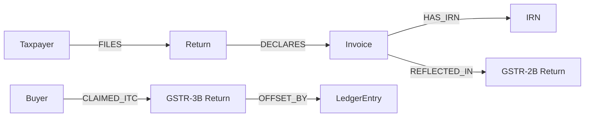

# GST Knowledge Graph Reconciliation Engine

**Production-grade Knowledge Graph–based GST Reconciliation Engine** for India's GST ecosystem.
All reconciliation uses **graph traversal** — zero SQL joins.

## Architecture

```
┌─────────────┐     ┌─────────────┐     ┌──────────────┐
│   React UI   │────▶│   FastAPI    │────▶│    Neo4j     │
│   Port 3000  │     │   Port 8000  │     │  Port 7687   │
│  TypeScript  │     │   Python     │     │  Graph DB    │
│  Recharts    │     │   Pydantic   │     │  Cypher      │
│  D3.js       │     │   XGBoost    │     │  APOC        │
└─────────────┘     └─────────────┘     └──────────────┘
```

## Quick Start

### Docker (Recommended)

```bash
cd gst-graph-recon
docker compose up --build
```

Services will be available at:
- **Frontend**: http://localhost:3000
- **Backend API**: http://localhost:8000
- **Swagger Docs**: http://localhost:8000/docs
- **Neo4j Browser**: http://localhost:7474

### Local Development

**Backend:**
```bash
cd backend
python -m venv venv && source venv/bin/activate
pip install -r requirements.txt
uvicorn app.main:app --reload --port 8000
```

**Frontend:**
```bash
cd frontend
npm install
npm run dev
```

**Neo4j:** Use Docker or install locally (bolt://localhost:7687, user: neo4j, password: gstrecon2025)

## Knowledge Graph Schema



**Nodes:** Taxpayer, Return (GSTR1/2B/3B), Invoice, IRN, ITCClaim, LedgerEntry
**Relationships:** FILES, DECLARES, HAS_IRN, REFLECTED_IN, CLAIMED_ITC, OFFSET_BY

## API Documentation

### Data Ingestion

| Method | Endpoint | Description |
|--------|----------|-------------|
| POST | `/ingest/gstr1` | Ingest GSTR-1 supplier data |
| POST | `/ingest/gstr2b` | Ingest GSTR-2B buyer data |
| POST | `/ingest/einvoice` | Ingest e-invoice IRN data |
| POST | `/ingest/purchase-register` | Ingest GSTR-3B + ledger data |

### Reconciliation & Analysis

| Method | Endpoint | Description |
|--------|----------|-------------|
| GET | `/reconcile/{buyer_gstin}/{period}` | Run ITC reconciliation |
| GET | `/vendor-risk/{gstin}` | Get vendor risk score |
| GET | `/vendor-risk` | Get all vendor risks |
| GET | `/dashboard/summary` | Dashboard aggregation |
| GET | `/audit/{invoiceNo}` | Explainable audit trail |
| GET | `/analytics/network-risk` | Network risk analysis |

### Example: Run Reconciliation

**Request:**
```
GET /reconcile/29BUYER001KA1Z5/042025
```

**Response:**
```json
{
  "buyerGSTIN": "29BUYER001KA1Z5",
  "period": "042025",
  "totalInvoices": 10,
  "validCount": 6,
  "mismatchCount": 4,
  "results": [
    {
      "invoiceNo": "INV001",
      "supplierGSTIN": "29AABCS1234F1Z5",
      "status": "VALID",
      "riskLevel": "LOW",
      "rootCause": []
    },
    {
      "invoiceNo": "INV027",
      "supplierGSTIN": "06AABCX1234K1Z5",
      "status": "MISMATCH",
      "riskLevel": "HIGH",
      "rootCause": [
        "Supplier has not filed GSTR-1 for this period",
        "No IRN generated for this invoice"
      ]
    }
  ]
}
```

### Example: Audit Trail

**Request:**
```
GET /audit/INV027
```

**Response:**
```json
{
  "invoiceNo": "INV027",
  "supplierGSTIN": "06AABCX1234K1Z5",
  "buyerGSTIN": "29BUYER001KA1Z5",
  "structuredReasoning": [
    {"step": 1, "check": "Supplier Identity", "status": "PASS", "detail": "Supplier registered"},
    {"step": 2, "check": "GSTR-1 Filing", "status": "FAIL", "detail": "Not filed"},
    {"step": 3, "check": "IRN Verification", "status": "FAIL", "detail": "No IRN generated"}
  ],
  "plainEnglish": "Invoice INV027 from Haryana Chemicals Ltd (GSTIN 06AABCX1234K1Z5) for ₹41,400.00 GST was reviewed. The supplier has NOT filed GSTR-1, making ITC ineligible. No IRN exists. Risk classified as HIGH.",
  "recommendedActions": ["Contact supplier to file GSTR-1", "Consider ITC reversal"],
  "riskLevel": "HIGH"
}
```

## Risk Scoring Formula

```
Risk Score = 0.30 × FilingDelay
           + 0.25 × MismatchRatio
           + 0.20 × IRNMissing
           + 0.15 × TaxDefault
           + 0.10 × NetworkRisk
```

Classification: **LOW** (<0.3) | **MEDIUM** (0.3–0.7) | **HIGH** (≥0.7)

## Testing

```bash
cd backend
pip install -r requirements.txt
python -m pytest tests/ -v
```

## Mock Dataset

50 invoices across 10 suppliers and 5 buyers with deliberate edge cases:
- **Missing IRN**: 27 invoices without active IRN
- **Cancelled IRN**: INV010, INV042
- **Supplier non-filing**: Haryana Chemicals (06AABCX1234K1Z5)
- **Late filing**: Tech Solutions MH, Telangana IT Services
- **Invoices not in GSTR-2B**: 25 invoices

## Project Structure

```
gst-graph-recon/
├── backend/
│   ├── app/
│   │   ├── main.py              # FastAPI entry
│   │   ├── config.py            # Settings
│   │   ├── database.py          # Neo4j driver
│   │   ├── models.py            # Pydantic models
│   │   ├── ingestion/           # Data loaders
│   │   ├── reconciliation/      # Graph traversal engine
│   │   ├── risk/                # Risk scoring + XGBoost
│   │   ├── audit/               # Explainable audit
│   │   ├── analytics/           # PageRank, communities
│   │   └── routes/              # API endpoints
│   ├── data/mock_dataset.json
│   ├── tests/
│   ├── Dockerfile
│   └── requirements.txt
├── frontend/
│   ├── src/
│   │   ├── pages/               # Dashboard, VendorRisk, Reconciliation
│   │   ├── components/          # RiskCard, GraphView, MismatchTable
│   │   └── api/client.ts        # Typed API client
│   ├── Dockerfile
│   └── package.json
├── docker-compose.yml
└── README.md
```

## License

MIT
